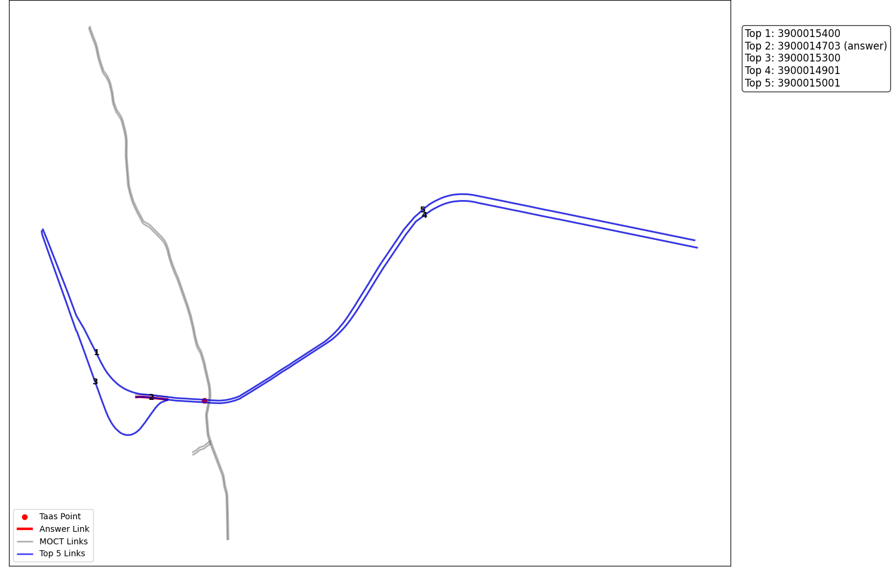
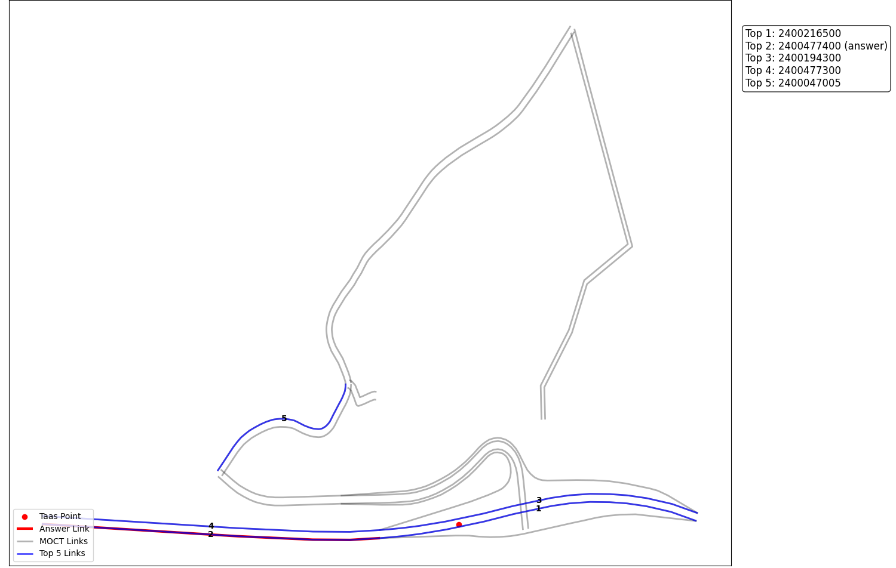
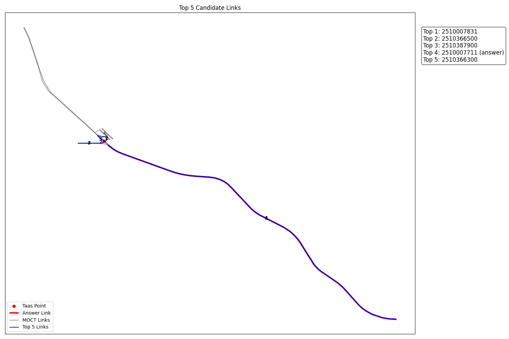
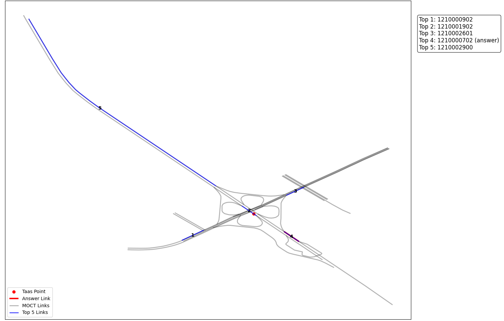

# 사고 맵매칭 결과

도로 위에서 발생한 사고 지점을 실제 지도 위에 맵매칭하여 시각화한 결과입니다.  
사고가 일어났을 것으로 판단하는 링크를 top 5를 산출하고 이에 대해 recall@5를 평가지표로 합니다.  
다음 결과 이미지 예시는 top 5에 대한 예시 입니다.  

- 빨간점은 임의의 사고 지점입니다.  
- 빨간선은 정답 도로, 파란선은 top 5 도로, 검은선은 top 5에서 제외된 도로를 의미합니다.  
---

## 📍 결과 이미지

### 매칭 결과 예시 1

### 매칭 결과 예시 2

### 매칭 결과 예시 3

### 매칭 결과 예시 4

## 📍 평가 지표: recall@5, recall@1

총 46개의 사고 테스트 데이터로 측정한 결과입니다.  
**recall@5: 0.89** 이는 100개 중 89개 정도는 예측 링크가 top5에 든다는 의미입니다.  
**recall@1: 산출중** 