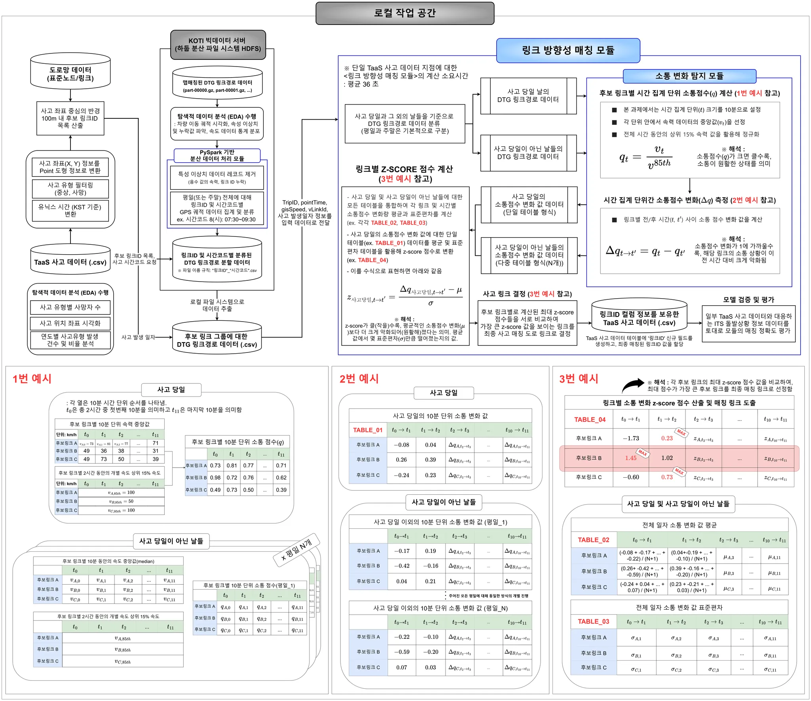

# 사고-링크 방향성 매칭 프로세스

## 전체 프로세스의 흐름

# 사고 맵매칭 결과

도로 위에서 발생한 사고 지점을 실제 지도 위에 맵매칭하여 시각화한 결과입니다.  
사고가 일어났을 것으로 판단하는 링크를(link id) 산출하고 이에 대해 accuracy를 평가지표로 측정합니다.  
다음 결과 이미지 예시는 사고 맵매칭 결과에 대한 예시 입니다.  

- 빨간점은 임의의 사고 지점입니다.  
- 빨간선은 정답 링크, 파란선은 예측 링크, 검은선은 후보 링크를 의미합니다.  
---

## 📍 결과 이미지

### 매칭 결과 예시 1

### 매칭 결과 예시 2

### 매칭 결과 예시 3

### 매칭 결과 예시 4

## 📍 평가 지표: accuracy

총 56개의 사고 테스트 데이터로 측정한 결과입니다.  
**accuracy: 측정 중** 